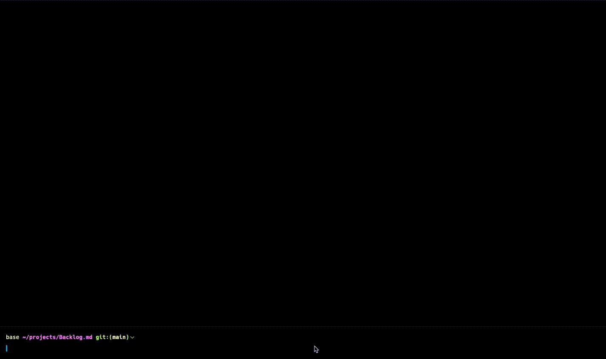

<h1 align="center">Backlog.md</h1>
<p align="center">Markdown‑native Task Manager &amp; Kanban visualizer for any Git repository</p>

<p align="center">
<code>npm i -g backlog.md</code> or <code>bun add -g backlog.md</code>
</p>




---

> **Backlog.md** turns any folder with a Git repo into a **self‑contained project board**  
> powered by plain Markdown files and a zero‑config CLI.


## Features

* 📝 **Markdown-native tasks** -- manage every issue as a plain `.md` file

* 🔒 **100 % private & offline** -- backlog lives entirely inside your repo

* 📊 **Instant terminal Kanban** -- `backlog board` paints a live board in your shell

* 🌐 **Modern web interface** -- `backlog browser` launches a sleek web UI for visual task management

* 🤖 **AI-ready CLI** -- "Claude, please take over task 33"

* 🔍 **Rich query commands** -- view, list, filter, or archive tasks with ease

* 💻 **Cross-platform** -- runs on macOS, Linux, and Windows

* 🆓 **MIT-licensed & open-source** -- free for personal or commercial use

---

### Five‑minute tour

```markdown
# Make sure you have Backlog.md installed
bun/npm i -g backlog.md

# 1. Bootstrap a repo + backlog
backlog init hello-

# 2. Capture work
backlog task create "Render markdown as kanban"

# 3. See where you stand
backlog board view

# 4. Working with AI
Claude I would like to build a search functionality in the web view that searches for tasks, docs or decisions.
Please create relevant tasks to tackle this request.
```

All data is saved under `backlog` folder as human‑readable Markdown with the following format `task-<task-id> - <task-title>.md` (e.g. `task-12 - Fix typo.md`).

---

### Web Interface

Launch a modern, responsive web interface for visual task management:

```bash
# Start the web server (opens browser automatically)
backlog browser

# Custom port
backlog browser --port 8080

# Don't open browser automatically
backlog browser --no-open
```


The web interface provides:
- **Interactive Kanban board** with drag-and-drop functionality
- **Task creation and editing** with rich forms and validation
- **Real-time updates** as you manage tasks
- **Responsive design** that works on desktop and mobile
- **Archive tasks** with confirmation dialogs
- **Seamless CLI integration** - changes sync with your markdown files

---

## CLI reference (essentials)

| Action      | Example                                              |
|-------------|------------------------------------------------------|
| Create task | `backlog task create "Add OAuth System"`                    |
| Create with description | `backlog task create "Feature" -d "Add authentication system"` |
| Create with assignee | `backlog task create "Feature" -a @sara`           |
| Create with status | `backlog task create "Feature" -s "In Progress"`    |
| Create with labels | `backlog task create "Feature" -l auth,backend`     |
| Create with priority | `backlog task create "Feature" --priority high`     |
| Create with plan | `backlog task create "Feature" --plan "1. Research\n2. Implement"`     |
| Create with AC | `backlog task create "Feature" --ac "Must work,Must be tested"` |
| Create with notes | `backlog task create "Feature" --notes "Started initial research"` |
| Create with deps | `backlog task create "Feature" --dep task-1,task-2` |
| Create sub task | `backlog task create -p 14 "Add Login with Google"`|
| Create draft | `backlog task create "Feature" --draft`             |
| Create (all options) | `backlog task create "Feature" -d "Description" -a @sara -s "To Do" -l auth --priority high --ac "Must work" --notes "Initial setup done" --dep task-1 -p 14` |
| List tasks  | `backlog task list [-s <status>] [-a <assignee>] [-p <parent>]` |
| List by parent | `backlog task list --parent 42` or `backlog task list -p task-42` |
| View detail | `backlog task 7` (interactive UI, press 'E' to edit in editor) |
| View (AI mode) | `backlog task 7 --plain`                           |
| Edit        | `backlog task edit 7 -a @sara -l auth,backend`       |
| Add plan    | `backlog task edit 7 --plan "Implementation approach"`    |
| Add AC      | `backlog task edit 7 --ac "New criterion,Another one"`    |
| Add notes   | `backlog task edit 7 --notes "Completed X, working on Y"` |
| Add deps    | `backlog task edit 7 --dep task-1 --dep task-2`     |
| Archive     | `backlog task archive 7`                             |
| Draft flow  | `backlog draft create "Spike GraphQL"` → `backlog draft promote 3.1` |
| Demote to draft| `backlog task demote <id>` |
| Kanban board      | `backlog board` (interactive UI, press 'E' to edit in editor) |
| Web interface | `backlog browser` (launches web UI on port 6420) |
| Web custom port | `backlog browser --port 8080 --no-open` |
| Config editor | `backlog config set defaultEditor "code --wait"` |
| Enable auto-commit | `backlog config set autoCommit true` |
| View config | `backlog config list` |

Full help: `backlog --help`

---

## Configuration

Backlog.md merges the following layers (highest → lowest):

1. CLI flags  
2. `backlog/config.yml` (per‑project)  
3. `~/backlog/user` (per‑user)  
4. Built‑ins  

Key options:

| Key               | Purpose            | Default                       |
|-------------------|--------------------|-------------------------------|
| `default_assignee`| Pre‑fill assignee  | `[]`                          |
| `default_status`  | First column       | `To Do`                       |
| `statuses`        | Board columns      | `[To Do, In Progress, Done]`  |
| `date_format`     | ISO or locale      | `yyyy-mm-dd`                  |
| `default_editor`  | Editor for 'E' key | Platform default (nano/notepad) |
| `default_port`    | Web UI port        | `6420`                        |
| `auto_open_browser`| Open browser automatically | `true`            |
| `remote_operations`| Enable remote git operations | `true`           |
| `auto_commit`     | Automatically commit task changes | `false`       |

> **Note**: Set `remote_operations: false` to work offline. This disables git fetch operations and loads tasks from local branches only, useful when working without network connectivity.

> **Git Control**: By default, `auto_commit` is set to `false`, giving you full control over your git history. Task operations will modify files but won't automatically commit changes. Set `auto_commit: true` if you prefer automatic commits for each task operation.

---


## License

Backlog.md is released under the **MIT License** – do anything, just give credit. See [LICENSE](LICENSE).
